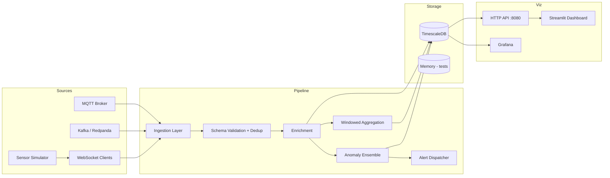

# Telemetry Pipeline

Modular, production-minded **real-time telemetry processing pipeline** in Python. Ingests high-frequency sensor data, validates and enriches events, computes windowed aggregations, stores time-series data, detects anomalies with an online ML ensemble, and visualizes results in Grafana or Streamlit.

## Architecture



## Features

- **Multi-transport ingestion**: MQTT, Kafka, WebSocket (config switch)
- **Validation**: JSON Schema + per-sensor range checks + deduplication
- **Stream processing**: Tumbling/sliding windows with mean/min/max/std/count
- **Storage**: TimescaleDB (production) or in-memory (tests)
- **Anomaly detection ensemble**:
  - Statistical (EWMA + z-score)
  - Online HalfSpaceTrees (`river`)
  - Online autoencoder (numpy / PyTorch / ONNX)
  - Rule-based thresholds from config
  - ADWIN concept drift detection
- **Live API**: HTTP API on `:8080` with JSON metrics for Streamlit
- **Prometheus**: `/metrics` endpoint + Prometheus server in Docker Compose
- **Benchmark harness**: Formal throughput/latency report (`telemetry-benchmark`)
- **Synthetic data**: High-frequency generator with labeled anomaly injection
- **Dataset replay**: NAB-style and pump CSV samples
- **Testing**: Unit, integration, load (1k events), and latency benchmarks

## Quick Start

### Prerequisites

- Python 3.11+
- Docker & Docker Compose (for full stack)

### Local Python (no Docker)

```bash
cd telemetry-pipeline
python -m venv .venv && source .venv/bin/activate
pip install -e ".[dev]"

# Terminal 1 — pipeline (WebSocket ingestion, in-memory storage for quick demo)
# Edit config/pipeline.yaml: set storage.backend: memory
python -m telemetry.main --config config/pipeline.yaml

# Terminal 2 — simulator
python -m telemetry.simulator.generator --duration 60

# Terminal 3 — Streamlit dashboard (reads live metrics from :8080)
streamlit run src/telemetry/viz/streamlit_app.py

# Benchmark harness
telemetry-benchmark --events 10000 --report benchmark_report.json
```

### Docker Compose (full stack)

```bash
docker compose up --build
```

| Service      | URL / Port                          |
|--------------|-------------------------------------|
| Pipeline API | http://localhost:8081/api/metrics   |
| Prometheus   | http://localhost:9090               |
| Grafana      | http://localhost:3000 (admin/admin) |
| TimescaleDB  | `localhost:5432`                    |
| Kafka        | `localhost:19092`                   |
| MQTT         | `localhost:1883`                    |

The simulator starts automatically and feeds the pipeline for 1 hour.

### Grafana dashboards (pre-provisioned)

Login at http://localhost:3000 (admin/admin) → **Dashboards → Telemetry → Telemetry Pipeline Overview**

The dashboard includes 14 panels:

| Section | Panels |
|---------|--------|
| **Overview stats** | Events/hr, active devices, anomalies/hr, avg ingest latency |
| **Ingestion** | Event rate, events by sensor type |
| **Sensor metrics** | Industrial temperature, windowed vibration |
| **Latency** | Ingest latency avg/P95 (Timescale), processing latency (Prometheus) |
| **Anomalies** | Detection rate, severity breakdown, recent anomalies table |
| **Pipeline health** | Throughput (eps) from Prometheus |

Datasources auto-provisioned: **TimescaleDB** (events/anomalies) + **Prometheus** (pipeline self-metrics).

To reload after editing `docker/grafana/provisioning/dashboards/telemetry-overview.json`:

```bash
docker compose restart grafana
```

## Configuration

All behavior is driven by YAML:

| File | Purpose |
|------|---------|
| `config/pipeline.yaml` | Transport, validation, processing, storage, anomaly, alerting |
| `config/sensors.yaml` | Sensor type definitions, baselines, rules |
| `config/schemas/sensor_event.json` | JSON Schema for events |

### Enable Slack alerting

1. Create a [Slack Incoming Webhook](https://api.slack.com/messaging/webhooks)
2. Copy `.env.example` → `.env` and set:

```bash
TELEMETRY_ALERTING_ENABLED=true
TELEMETRY_SLACK_WEBHOOK_URL=https://hooks.slack.com/services/...
TELEMETRY_ALERTING_MIN_SEVERITY=medium
TELEMETRY_ALERTING_COOLDOWN_SECONDS=60
```

3. Restart the pipeline: `docker compose up -d pipeline`

Alerts include severity color, device, score, top detection method, and drift flag. Cooldown prevents duplicate alerts per device.

### Switch ingestion transport

```yaml
ingestion:
  transport: kafka  # mqtt | kafka | websocket
```

### Add a new sensor type

1. Add entry under `sensor_types` in `config/sensors.yaml`
2. Add enum value in `config/schemas/sensor_event.json`
3. Optionally add rule thresholds under `rules`

Example event:

```json
{
  "device_id": "industrial-device-001",
  "sensor_type": "industrial",
  "timestamp": "2026-06-17T12:00:00Z",
  "metrics": {"temperature": 65.2, "pressure": 4.5, "vibration": 3.1},
  "tags": {"line": "A3"}
}
```

## CLI Commands

```bash
# Run pipeline
telemetry-pipeline --config config/pipeline.yaml

# Synthetic sensor data generator
telemetry-simulator --devices 10 --interval-ms 50 --anomaly-rate 0.05

# Replay labeled CSV dataset
telemetry-replay --csv data/sample/pump_sample.csv --speed 50

# Streamlit dashboard
telemetry-dashboard

# Throughput/latency benchmark
telemetry-benchmark --events 10000 --warmup 500
```

## Testing

```bash
pip install -e ".[dev]"
pytest -v
pytest tests/test_load.py -v      # throughput benchmark
pytest tests/test_latency.py -v   # latency budget check
```

### CI (GitHub Actions)

On every push/PR to `main`, CI runs:

1. **test** — full `pytest` suite
2. **smoke** — `docker compose up`, verifies `/health` and events flowing on `:8081`

Run the smoke test locally:

```bash
chmod +x scripts/smoke_test.sh
./scripts/smoke_test.sh
```

## Project Structure

```
telemetry-pipeline/
├── config/           # YAML schemas, sensor definitions
├── data/sample/      # NAB + pump CSV samples
├── docker/           # Dockerfiles, Timescale init, Grafana provisioning
├── src/telemetry/
│   ├── ingestion/    # MQTT, Kafka, WebSocket
│   ├── validation/   # Schema + enrichment
│   ├── processor/    # Windowed aggregation
│   ├── storage/      # TimescaleDB + memory
│   ├── anomaly/      # Ensemble detector + drift
│   ├── simulator/    # Generator + replay
│   └── viz/          # Streamlit + HTTP API
└── tests/            # Unit, integration, load, latency
```

## Extension Guide

### Add a new anomaly method

1. Create `src/telemetry/anomaly/my_method.py`
2. Wire into `AnomalyDetector.detect()` in `detector.py`
3. Add weight in `config/pipeline.yaml` under `anomaly.ensemble_weights`

### Switch to PyTorch autoencoder

```yaml
anomaly:
  autoencoder:
    backend: torch
```

Install ML extras: `pip install -e ".[ml]"`

### Export ONNX model

```python
from telemetry.anomaly.autoencoder import export_numpy_to_onnx
export_numpy_to_onnx(input_dim=3, hidden_dim=8, output_path="models/autoencoder.onnx")
```

Then set `anomaly.autoencoder.backend: onnx` in config.

### Add ClickHouse storage

1. Implement `StorageBackend` in `src/telemetry/storage/clickhouse.py`
2. Register in `create_storage()` factory
3. Add `storage.backend: clickhouse` option

### Production deployment

- Run pipeline + simulator as separate K8s deployments
- Use Kafka for ingestion at scale
- Enable alerting with Slack webhook in config
- Add Prometheus metrics exporter (hook into `PipelineMetrics`)
- Train custom autoencoder and serve via ONNX Runtime

## Performance Targets

| Metric | Local (memory) | Docker (Timescale) |
|--------|----------------|---------------------|
| Throughput | >1,000 eps | 500+ eps |
| Per-event processing | <100ms | <100ms |
| End-to-end ingest | <50ms typical | <100ms |

## License

MIT